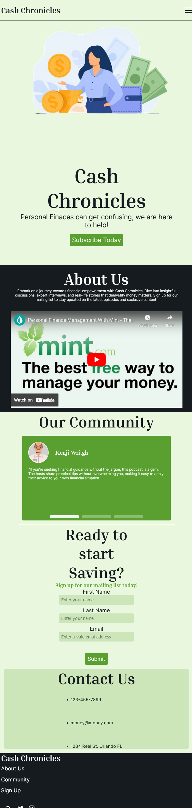

# Cash Chronicles Website README

[Live Website Link](https://smb78998.github.io/a_202420-CEN-4350/)

This is a full-stack website created with HTML, CSS, JavaScript, PHP, and SQL. 

The website advertises a fake podcast called "Cash Chronicles" and includes simple CSS animations and responsive design. The form on the webpage is supported by PHP, ensuring seamless data transmission to a SQL database.

## Table of contents

- [Overview](#overview)
- [Screenshots](#screenshot)
- [Links](#links)
- [Built with](#built-with)
- [Author](#author)

## Overview

## Screenshot

###Destok Website

###Mobile Website

## Built with

- HTML5 
- CSS 
- JavaScript
- PHP
- SQL

## Author

- Github - [smb78998](https://github.com/smb78998)
- Frontend Mentor - [@smb78998](https://www.frontendmentor.io/profile/smb78998)
- [Linkedin](https://www.linkedin.com/in/sophia-burgos-736a3a26b)
